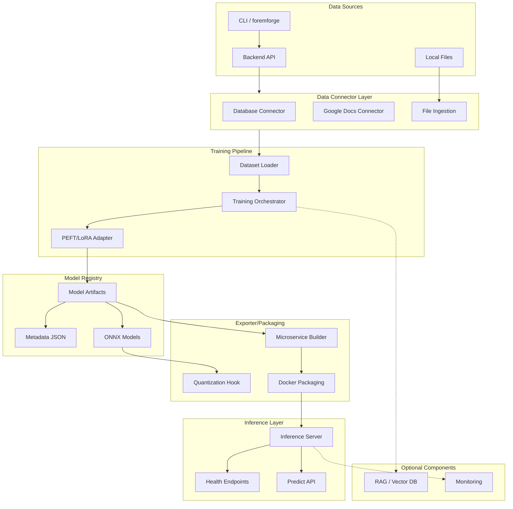

# TinyForgeAI Architecture
<!-- Generated by Claude Code: Step I.1 -->

**Last updated:** 2025-01-15T00:00:00Z

## Overview

TinyForgeAI is a lightweight platform for fine-tuning language models and deploying them as inference microservices. The system is designed with simplicity and developer experience in mind, enabling rapid prototyping of ML-powered applications without heavy infrastructure dependencies.

The platform follows a modular architecture where each component can operate independently or as part of an integrated pipeline. Data flows from various sources through connectors, gets processed by the training pipeline, and results in deployable model artifacts that can be served via containerized inference servers.

TinyForgeAI emphasizes offline-first development with mock modes for all external integrations, making it possible to develop and test the entire pipeline without network access or cloud credentials. The system produces lightweight artifacts suitable for CPU inference, with optional ONNX export and quantization for optimized deployment.

The CLI tool (`foremforge`) provides a unified interface for all platform operations, from project initialization to model serving, while the underlying Python APIs remain accessible for programmatic use and custom integrations.

## Architecture Diagram



## Train → Export → Serve Pipeline

The complete workflow from raw data to serving predictions follows these steps:

### Step 1: Prepare Training Data

Create a JSONL file with input/output pairs:

```bash
# View sample data format
cat examples/sample_qna.jsonl
```

### Step 2: Train the Model (Dry-Run)

Run the training pipeline to validate data and create model artifacts:

```bash
# Basic dry-run training
python backend/training/train.py --data examples/sample_qna.jsonl --out /tmp/tiny_model --dry-run

# With LoRA adapter
python backend/training/train.py --data examples/sample_qna.jsonl --out /tmp/tiny_model --dry-run --use-lora
```

This creates `/tmp/tiny_model/model_stub.json` with model metadata.

### Step 3: Export to Microservice

Package the model into a deployable inference service:

```bash
# Basic export
python backend/exporter/builder.py --model-path /tmp/tiny_model/model_stub.json --output-dir /tmp/tiny_service --overwrite

# With ONNX export and quantization
python backend/exporter/builder.py --model-path /tmp/tiny_model/model_stub.json --output-dir /tmp/tiny_service --overwrite --export-onnx
```

This creates a complete microservice in `/tmp/tiny_service/`.

### Step 4: Serve the Model

Start the inference server:

```bash
# Using uvicorn directly
cd /tmp/tiny_service
uvicorn app:app --host 0.0.0.0 --port 8001

# Or using the CLI
foremforge serve --dir /tmp/tiny_service --port 8001
```

### Step 5: Make Predictions

Query the running server:

```bash
# Health check
curl -sS http://127.0.0.1:8001/health

# Make a prediction
curl -sS -X POST http://127.0.0.1:8001/predict \
  -H "Content-Type: application/json" \
  -d '{"text":"hello"}'
```

### Using the CLI (Recommended)

The `foremforge` CLI simplifies the entire workflow:

```bash
# Initialize project structure
foremforge init --yes

# Train
foremforge train --data examples/sample_qna.jsonl --out /tmp/tiny_model --dry-run

# Export with ONNX
foremforge export --model /tmp/tiny_model/model_stub.json --out /tmp/tiny_service --overwrite --export-onnx

# Serve
foremforge serve --dir /tmp/tiny_service --port 8001
```

## Run the Demo

Try the complete workflow with our end-to-end demo scripts:

```bash
# Using bash (Linux/macOS/Git Bash on Windows)
bash examples/e2e_demo.sh

# Using Python (cross-platform)
python examples/e2e_demo.py
```

The demo performs all steps automatically:
1. Creates a temporary workspace
2. Copies sample training data
3. Runs dry-run training to create `model_stub.json`
4. Exports to an inference microservice
5. Tests the `/predict` endpoint using FastAPI TestClient

Expected output:

```
[Step 4] Running smoke test against generated service...
  -> Inference response:
{
  "output": "olleh",
  "confidence": 0.75
}

==================================================
Demo Complete!
==================================================

Summary:
  Model path:     /tmp/xxx/tiny_model/model_stub.json
  Service path:   /tmp/xxx/service
  Response:       {"output": "olleh", "confidence": 0.75}
```

Use `--cleanup` to automatically delete the workspace when done.

## Operational Concerns

### Security

- **API Keys**: Never commit credentials to the repository. Use environment variables or `.env` files (excluded from git).
- **Private Data**: Training data may contain sensitive information. Ensure proper access controls on data directories and model artifacts.
- **Network Exposure**: The inference server binds to `0.0.0.0` by default. In production, use a reverse proxy (nginx) with TLS.
- **Docker Security**: The Dockerfile runs as a non-root user. Ensure mounted volumes have appropriate permissions.

### Resource Considerations

- **CPU Inference**: The stub implementation is lightweight. Real model inference may require significant CPU/memory.
- **Quantization**: Use INT8 quantization (`--export-onnx`) to reduce model size and improve CPU inference speed.
- **Memory**: Monitor memory usage during training. Large datasets should be streamed rather than loaded entirely.
- **Disk Space**: Model artifacts and ONNX files can be large. Implement cleanup policies for old artifacts.

### Monitoring and Logging

Key monitoring points:

| Component | Endpoint/Log | What to Monitor |
|-----------|--------------|-----------------|
| Inference Server | `/health` | Uptime, response time |
| Inference Server | `/predict` | Latency, error rate, throughput |
| Training | stdout logs | Progress, validation metrics |
| Docker | Container logs | Startup errors, OOM events |

Logging configuration:

```python
# Set log level via environment variable
LOG_LEVEL=DEBUG python backend/training/train.py ...
```

## Where to Find the Code

| Component | Path | Description |
|-----------|------|-------------|
| Backend API | `backend/api/` | FastAPI application with health routes |
| Training Pipeline | `backend/training/` | Dataset loader, trainer, PEFT adapter |
| Model Exporter | `backend/exporter/` | Builder, ONNX export, quantization |
| Data Connectors | `connectors/` | DB, Google Docs, file ingestion |
| Inference Server | `inference_server/` | FastAPI inference service template |
| CLI Tool | `cli/` | foremforge Click-based CLI |
| Docker Config | `docker/` | Dockerfile and docker-compose |
| Tests | `tests/` | pytest test suite |
| Documentation | `docs/` | This documentation |
| Examples | `examples/` | Sample data files |

## Related Documentation

- [Training Pipeline](training.md) - Detailed training documentation
- [Data Connectors](connectors.md) - Connector configuration and usage
- [CI/CD](ci.md) - Continuous integration setup
- [Docker Guide](../docker/README.md) - Container deployment
